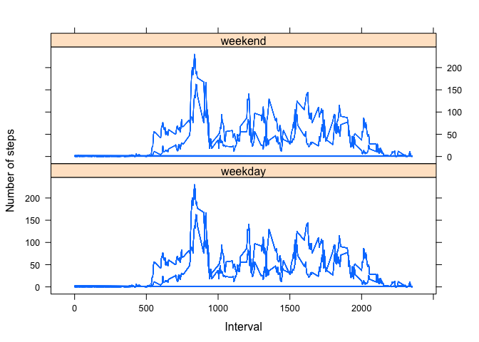

# Reproducible Research: Peer Assessment 1


## Loading and preprocessing the data

```r
data <- read.csv("./activity.csv")
## Create subsets of original data for different parts of the assignment
dt1 <- data[complete.cases(data),]
get_steps_by_date <- function(x) {
  split(x[,"steps"], x[,"date"])
}
get_steps_by_int <- function(x) { 
  split(x[,"steps"], x[,"interval"])
}
```

## What is mean total number of steps taken per day?

```r
exec_part2 <- function(x) {
  steps_by_date <- get_steps_by_date(x)

  ## Total number of steps taken each day
  total_steps_by_date <- sapply(steps_by_date, sum)
  summary(total_steps_by_date) 
  hist(total_steps_by_date, main = "Histogram of Total Steps per Day", xlab = "Total Steps per Day")
  
  ## Mean of the Total number of steps taken each day
  mean_steps_by_day <- sapply(steps_by_date, mean)
  tot_mean <- mean(mean_steps_by_day, na.rm = T)
  
  ## Median of the Total number of steps taken each day
  median_steps_by_day <- sapply(steps_by_date, median)
  tot_med <- median(median_steps_by_day, na.rm = T)
  
  gettmn <- function() { tot_mean }
  gettmdn <- function() { tot_med }
  
  list(gettmdn = gettmdn, gettmn = gettmn, total_steps_by_date = total_steps_by_date, mean_steps_by_day = mean_steps_by_day, median_steps_by_day = median_steps_by_day)
}

tot_vals <- exec_part2(dt1)
```

 

```r
tot_mean1 <- tot_vals$gettmn()
tot_steps1 <- tot_vals$total_steps_by_date

tot_vals$median_steps_by_day
```

```
## 2012-10-01 2012-10-02 2012-10-03 2012-10-04 2012-10-05 2012-10-06 
##         NA          0          0          0          0          0 
## 2012-10-07 2012-10-08 2012-10-09 2012-10-10 2012-10-11 2012-10-12 
##          0         NA          0          0          0          0 
## 2012-10-13 2012-10-14 2012-10-15 2012-10-16 2012-10-17 2012-10-18 
##          0          0          0          0          0          0 
## 2012-10-19 2012-10-20 2012-10-21 2012-10-22 2012-10-23 2012-10-24 
##          0          0          0          0          0          0 
## 2012-10-25 2012-10-26 2012-10-27 2012-10-28 2012-10-29 2012-10-30 
##          0          0          0          0          0          0 
## 2012-10-31 2012-11-01 2012-11-02 2012-11-03 2012-11-04 2012-11-05 
##          0         NA          0          0         NA          0 
## 2012-11-06 2012-11-07 2012-11-08 2012-11-09 2012-11-10 2012-11-11 
##          0          0          0         NA         NA          0 
## 2012-11-12 2012-11-13 2012-11-14 2012-11-15 2012-11-16 2012-11-17 
##          0          0         NA          0          0          0 
## 2012-11-18 2012-11-19 2012-11-20 2012-11-21 2012-11-22 2012-11-23 
##          0          0          0          0          0          0 
## 2012-11-24 2012-11-25 2012-11-26 2012-11-27 2012-11-28 2012-11-29 
##          0          0          0          0          0          0 
## 2012-11-30 
##         NA
```

```r
tot_vals$mean_steps_by_day
```

```
## 2012-10-01 2012-10-02 2012-10-03 2012-10-04 2012-10-05 2012-10-06 
##        NaN  0.4375000 39.4166667 42.0694444 46.1597222 53.5416667 
## 2012-10-07 2012-10-08 2012-10-09 2012-10-10 2012-10-11 2012-10-12 
## 38.2465278        NaN 44.4826389 34.3750000 35.7777778 60.3541667 
## 2012-10-13 2012-10-14 2012-10-15 2012-10-16 2012-10-17 2012-10-18 
## 43.1458333 52.4236111 35.2048611 52.3750000 46.7083333 34.9166667 
## 2012-10-19 2012-10-20 2012-10-21 2012-10-22 2012-10-23 2012-10-24 
## 41.0729167 36.0937500 30.6284722 46.7361111 30.9652778 29.0104167 
## 2012-10-25 2012-10-26 2012-10-27 2012-10-28 2012-10-29 2012-10-30 
##  8.6527778 23.5347222 35.1354167 39.7847222 17.4236111 34.0937500 
## 2012-10-31 2012-11-01 2012-11-02 2012-11-03 2012-11-04 2012-11-05 
## 53.5208333        NaN 36.8055556 36.7048611        NaN 36.2465278 
## 2012-11-06 2012-11-07 2012-11-08 2012-11-09 2012-11-10 2012-11-11 
## 28.9375000 44.7326389 11.1770833        NaN        NaN 43.7777778 
## 2012-11-12 2012-11-13 2012-11-14 2012-11-15 2012-11-16 2012-11-17 
## 37.3784722 25.4722222        NaN  0.1423611 18.8923611 49.7881944 
## 2012-11-18 2012-11-19 2012-11-20 2012-11-21 2012-11-22 2012-11-23 
## 52.4652778 30.6979167 15.5277778 44.3993056 70.9270833 73.5902778 
## 2012-11-24 2012-11-25 2012-11-26 2012-11-27 2012-11-28 2012-11-29 
## 50.2708333 41.0902778 38.7569444 47.3819444 35.3576389 24.4687500 
## 2012-11-30 
##        NaN
```

The Mean of the Total number of steps taken each day is : **37.3825996**  
The Median of the Total number of steps taken each day is : **0**  


## What is the average daily activity pattern?

```r
exec_part3 <- function(x) {
  steps_by_int <- get_steps_by_int(x)
  int <- names(steps_by_int)
  
  ## Mean Steps by Interval
  mean_steps_by_int <- sapply(steps_by_int, mean)
  
  ## Obtain the max of the mean steps per interval and its interval name
  tot_max <- max(mean_steps_by_int, na.rm = T)
  max_int <- names(mean_steps_by_int[which.max(mean_steps_by_int)])
  
  gettmax <- function() { tot_max }
  
  list(gettmax = gettmax, int = int, max_int = max_int, mean_steps_by_int = mean_steps_by_int)
  
}

tot_vals <- exec_part3(dt1)
mean_steps_by_int <- tot_vals$mean_steps_by_int

## Assigning a meaningful name to the Intervals for easier understanding
intervals <- strptime(sprintf("%04d", as.numeric(names(mean_steps_by_int))), format="%H%M")

## Plotting the intervals against the Avg number of steps taken per Interval across all days
plot(intervals, mean_steps_by_int, type = "l", xlab="Interval (hh:mm)", ylab="Steps per interval")
```

 

```r
tot_max <- tot_vals$gettmax()
int <- tot_vals$int
max_int <- tot_vals$max_int
```
On Average across all days, the Interval - **835** - contains the Maximum number of Steps which is equal to - **206.1698113**  

## Imputing missing values  


```r
## Count of Missing Values in the dataset  
cnt_na <- sum(! complete.cases(data))
```
The total number of missing values in the dataset are : **2304**  


```r
## Create a data table to store the new imputed dataset
require(data.table)
```

```
## Loading required package: data.table
```

```r
data2 <- as.data.table(data)

## Fill-in the missing values with the mean of steps per interval for each missing value
data2[is.na(data2$steps), steps := as.integer(mean_steps_by_int[int])]

## Check if there are any NAs still left in the new data table
if (sum(! complete.cases(data2)) == 0) {
  print("All Missing Values are imputed")
}
```

```
## [1] "All Missing Values are imputed"
```

```r
tot_vals <- exec_part2(setDF(data2))
```

 

```r
tot_mean2 <- tot_vals$gettmn()
tot_steps2 <- tot_vals$total_steps_by_date

stps_diff <- abs(tot_steps1 - tot_steps2)
stps_diff_dts <- names(stps_diff[which(stps_diff != 0)])
```

The Mean of the Total number of steps taken each day (after imputation) is : **37.325592**  
The Median of the Total number of steps taken each day (after imputation) is : **0** 

The Difference between the values of mean from the first part of assignment (i.e., before imputation and after imputation) is : **0.0570076**

There is no difference between the median values before and after the imputation.

The Difference between the values of total steps per day from the first part of assignment (i.e., before imputation and after imputation) is observed for the following dates: 
**2012-10-01, 2012-10-08, 2012-11-01, 2012-11-04, 2012-11-09, 2012-11-10, 2012-11-14, 2012-11-30**

## Are there differences in activity patterns between weekdays and weekends?


```r
## Create a Factor Variable containing two levels one each for weekday and weekend
type_of_day <- factor(c("Monday"="0", "Tuesday"="0", "Wednesday"="0", "Thursday"="0", "Friday"="0", "Saturday"="1", "Sunday"="1"), levels = c("weekday"="0","weekend"="1"))

## Setting the imputed dataset back to data table
setDT(data2)

data2[, type_of_day := type_of_day[weekdays(as.Date(date))]]
data2[data2$type_of_day == 1,]
```

```
##       steps       date interval type_of_day
##    1:     0 2012-10-06        0           1
##    2:     0 2012-10-06        5           1
##    3:     0 2012-10-06       10           1
##    4:     0 2012-10-06       15           1
##    5:     0 2012-10-06       20           1
##   ---                                      
## 4604:   176 2012-11-25     2335           1
## 4605:    94 2012-11-25     2340           1
## 4606:    26 2012-11-25     2345           1
## 4607:     0 2012-11-25     2350           1
## 4608:     0 2012-11-25     2355           1
```

```r
td <- names(data2[, type_of_day])

tot_vals1 <- exec_part3(setDF(data2[data2$type_of_day == 0,]))
mean_steps_by_int0 <- tot_vals1$mean_steps_by_int
tot_vals1$gettmax()
```

```
## [1] 230.3556
```

```r
tot_vals2 <- exec_part3(setDF(data2[data2$type_of_day == 1,]))
mean_steps_by_int1 <- tot_vals2$mean_steps_by_int
tot_vals2$gettmax()
```

```
## [1] 166.625
```

```r
## Get the plots into one single figure
par(mfrow=c(1,1))
plot(int, mean_steps_by_int0, type = "l", xlab="Interval", ylab="Number of Steps", main = "weekday")
```

 

```r
#par(mar=c(0, 5, 9, 4))
plot(int, mean_steps_by_int1, type="l", xlab = "Interval", ylab="Number of Steps", main = "weekend")
```

 
